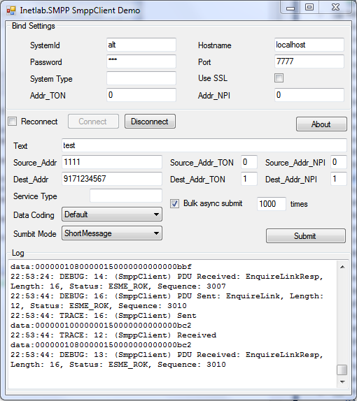
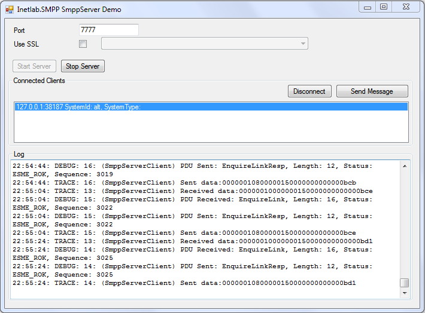

Introduction
============

Overview
--------
Adding a full-featured SMS functionality to your own product can be a tough job. 
Of course, you can always send direct queries to some Web-to-SMS gateway, but they do not always work properly, or don't support certain options you may need.

Inetlab.SMPP is a .NET library working via SMPP v3.4 protocol. With it you can build SMS sending functions into your own .NET application with minimum efforts. Now you don't have to spend hours trying to figure out the protocols; instead you can develop a ready-made application with Inetlab.SMPP library.

The library supports developing both SMPP client and SMPP server applications capable of sending thousands of SMS messages per minute, working in both directions (that is, sending and receiving messages). Inetlab.SMPP library provides a simple way to implement all standard SMS functions, starting from concatenated messages and flash SMS to immediate SMS delivery via asynchronous multi-thread sending and the support for keeping an SMSC connection alive with EnquireLink.
A server-side application made with Inetlab.SMPP supports multiple client connections, works flawlessly thanks to multi-threading and provides 100% safety by means of a secure SSL connection.

Inetlab.SMPP is available both as a .NET library and in source codes.

**Inetlab.SMPP features**:

  - Supports concatenated messages in full
  - Sends and receives SMS messages
  - Works with any language including Arabic, Chinese, Hebrew, Russian, Greek. Also supports Unicode messages.
  - Supports Flash SMS and WAP Push messages in full
  - Reliable bulk SMS-sending - up to 500 messages per second
  - Keeps a connection to SMSC server alive via EnquireLink
  - Works via SSL connection
  - Server-side application supports multiple client connections

Demo applications
-----------------

You can [download](http://www.inetlab.com/Downloading/Inetlab.SMPP.zip) sample application and learn how to implement solutions with Inetlab.SMPP library 

**SMPP Client**

**SMPP Server**

